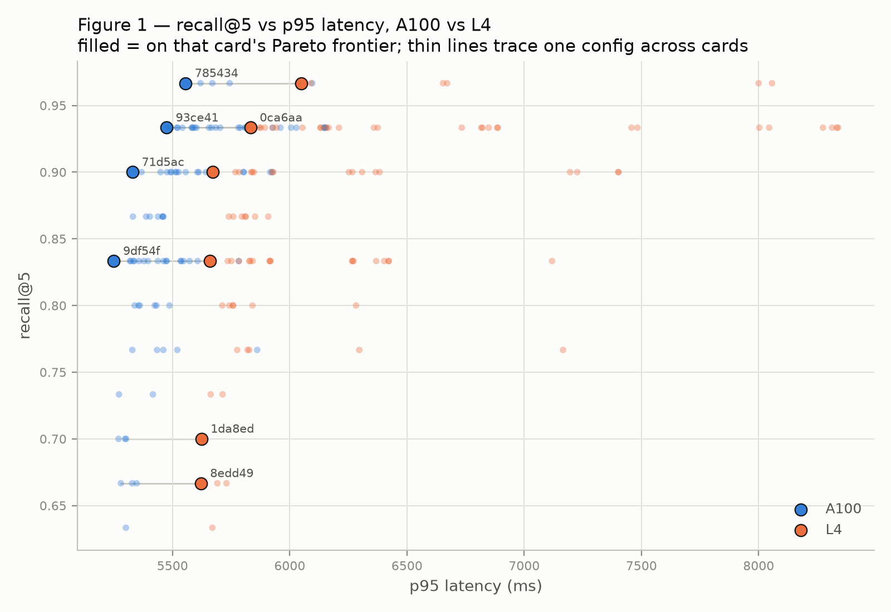

# Does the Pareto-optimal RAG configuration transfer across GPU tiers?

**Measurement 01** of a 4-paper research programme testing whether the optimal
configuration of an AI pipeline depends on the hardware it runs on.

<p align="left">
  <a href="paper/main.pdf">
    
  </a>
</p>

---

## Abstract

Configuration-search papers for RAG pipelines report a single Pareto-optimal
recommendation, benchmarked on whichever GPU the authors had, and say
nothing about whether that recommendation survives a move to cheaper
hardware. We measure it directly: an identical 96-configuration grid
(chunk size, overlap, embedding model, top-k, reranker) swept against one
corpus and one hand-labelled gold set on an **A100-SXM4-40GB** and an **L4**,
provenance-stamped per record. The result is partial, not the clean
confirmation or refutation pre-registered. Pareto-frontier membership does
change between cards — 4 members on the A100, 6 on the L4, 3 shared — but
the knob that moves is the **embedding model**, not the cross-encoder
reranker the pre-registered hypothesis named. The reranker's own latency
does degrade disproportionately on the weaker card (1.40× vs. 1.04–1.17×
for every other pipeline stage) — the predicted economics are real and
measurable — but at only ~1–1.5% of a generation-dominated cell's latency,
that disproportion is not yet large enough to flip frontier membership.
Kendall tau between the two cards' latency rankings is 0.80: most of the
ordering transfers, not all of it.

## Hypothesis (pre-registered before any sweep)

> The Pareto-optimal RAG configuration is **not hardware-invariant**. Chunk
> size and top-k keep their optimal settings across GPU tiers, but
> cross-encoder reranking flips from Pareto-optimal on the A100 to
> Pareto-dominated on the L4 — its latency cost grows faster than the
> recall it buys.

**Verdict: PARTIAL.** Frontier composition does change across cards, but the
knob that moved was the embedding model, not the reranker. See
[`SCOPE.md`](SCOPE.md) for the full refutation/partial criteria and
[`results/analysis.md`](results/analysis.md) for the underlying numbers.

## Result



*Filled markers are on that card's Pareto frontier; thin lines trace one
configuration across both cards. Full frontier/knob breakdown and Kendall
tau computation in [`results/analysis.md`](results/analysis.md) and
[`results/sensitivity.md`](results/sensitivity.md).*

## Pipeline under test

```
recursive-character chunking → sentence-transformer embedding → FAISS retrieval
    → optional cross-encoder rerank → 3B-class instruct generation
```

| Stage      | Model(s) swept                                          |
|------------|-----------------------------------------------------------|
| Embedding  | `small` variant, `BAAI/bge-base-en-v1.5`                   |
| Retrieval  | FAISS (exact)                                              |
| Reranker   | `cross-encoder/ms-marco-MiniLM-L6-v2`, or off               |
| Generation | `Qwen/Qwen2.5-3B-Instruct` (fixed, unswept)                 |

Grid: chunk size × overlap × embedding model × top-k × reranker = **96
frozen cells** (`configs/grid.yaml`), measured identically on both GPU
tiers against one 15-document corpus (`corpus/`) and one 30-query
hand-labelled gold set (`data/gold.jsonl`).

Out of scope: generation quality as an outcome, a third (T4) hardware
tier, agentic/multi-hop retrieval, and any corpus other than the one
frozen here — see [`SCOPE.md`](SCOPE.md).

## Repository layout

```
retrieval/          pipeline implementation (chunker, embed, store, eval, bench, pareto, provenance)
scripts/            sweep runner, grid/pair verification, analysis, sensitivity
configs/            frozen grid + pinned model revisions
corpus/             the 15-document corpus (PDFs)
data/               gold labels + raw per-card sweep results (a100.jsonl, l4.jsonl)
results/            analysis.md, sensitivity.md, refusals.md — derived from data/
figs/               generated figures
paper/              LaTeX source and compiled PDF (paper/main.pdf)
tests/              pytest suite
SCOPE.md            pre-registered hypothesis and refutation criteria
```

## Reproducing

Requires Python ≥3.12 and [uv](https://docs.astral.sh/uv/).

```bash
uv sync
uv run pytest                          # unit tests
uv run python scripts/verify_grid.py   # checks configs/grid.yaml integrity
uv run python scripts/sweep.py --device cuda --out data/<card>.jsonl
uv run python scripts/analysis.py      # rebuilds results/analysis.md and figs/fig1.png
uv run python scripts/sensitivity.py   # rebuilds results/sensitivity.md
```

Every record in `data/*.jsonl` carries its own git SHA, corpus/gold
hashes, and model revisions (`retrieval/provenance.py`), so a result never
depends on external state to be trusted.

## Provenance discipline

- p50/p95 latency reported, never the mean (rented hosts have asymmetric
  tails).
- No GPU substitution — card identity is load-bearing to the thesis.
- Every result record is provenance-stamped (GPU, driver, CUDA, library
  versions, git SHA, seed, corpus/gold hashes) or it isn't a valid result.
- Where a pinned model revision is an inference rather than a directly
  recorded measurement, it is labelled as such — see
  [`configs/model_pins.yaml`](configs/model_pins.yaml).

## Related measurements

This is Measurement 01 (Retrieval) of a 4-paper programme comparing an
A100 (strong) vs. an L4 (weak) GPU tier across three independent
pipelines — retrieval, video ingestion, and LLM serving — feeding a
synthesizing Paper 4.

## Citation

```bibtex
@misc{tawil2026retrieval,
  author = {Tawil, Ahmad},
  title  = {Does the Pareto-optimal RAG configuration transfer across GPU tiers?},
  year   = {2026},
  note   = {Measurement 01 of a 4-paper hardware-transfer study}
}
```
